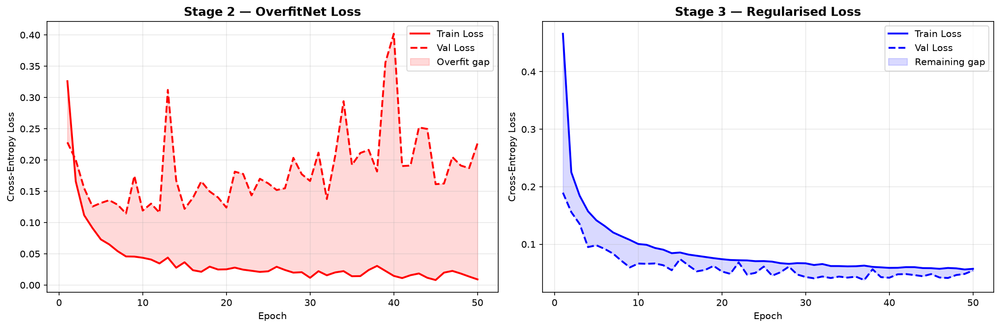
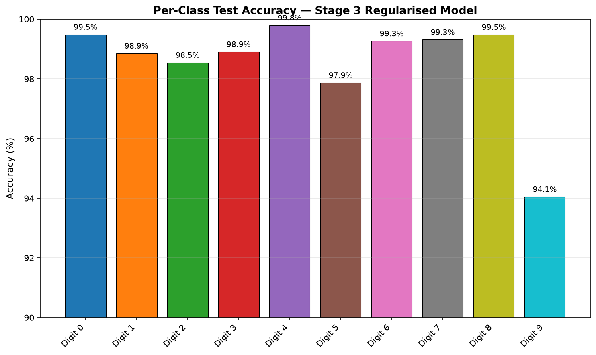

# MNIST Digit Recognition

This project trains a neural network to recognize handwritten digits from the MNIST dataset. It is written as a Jupyter notebook using PyTorch and is designed to demonstrate two important machine learning ideas:

- how a large model can overfit training data
- how regularization can improve performance on unseen data

The main notebook is [`mnist_digit_recognition.ipynb`](mnist_digit_recognition.ipynb).

## Project Overview

The project uses the MNIST dataset, which contains 70,000 grayscale images of handwritten digits from 0 to 9. Each image is 28 x 28 pixels.

The notebook follows three main stages:

1. Data pipeline: load MNIST, normalize the images, and create train, validation, and test loaders.
2. Overfitting experiment: train a very large fully connected network without regularization.
3. Regularized experiment: train the same architecture again with data augmentation, lower learning rate, and weight decay.

The goal is not just to get high accuracy, but to compare a model that memorizes training data with one that generalizes better.

## Dataset Split

| Split | Samples | Purpose |
|---|---:|---|
| Training | 50,000 | Used to update model weights |
| Validation | 10,000 | Used to monitor generalization during training |
| Test | 10,000 | Used only for final evaluation |

## Model Architecture

The neural network is called `OverfitNet`. It is a fully connected feed-forward network.

Architecture:

```text
Input image: 1 x 28 x 28
Flatten: 784 features
Linear: 784 -> 2048, ReLU
Linear: 2048 -> 2048, ReLU
Linear: 2048 -> 2048, ReLU
Linear: 2048 -> 2048, ReLU
Linear: 2048 -> 1024, ReLU
Linear: 1024 -> 10
Output: logits for digits 0-9
```

Total trainable parameters: **16,305,162**.

## Results

| Metric | Stage 2: Overfit Model | Stage 3: Regularized Model |
|---|---:|---:|
| Final train loss | 0.0091 | 0.0572 |
| Final validation loss | 0.2264 | 0.0543 |
| Final train accuracy | 99.82% | 98.14% |
| Final validation accuracy | 98.32% | 98.29% |
| Train-validation accuracy gap | 1.50 percentage points | -0.15 percentage points |
| Test accuracy | 98.19% | 98.56% |

Regularization improved test accuracy by **0.37 percentage points**.

## Generated Outputs

The notebook generates these result images:

- [`figures/loss_curves.png`](figures/loss_curves.png): compares training and validation loss curves.
- [`figures/stage2.png`](figures/stage2.png): shows Stage 2 overfitting performance.
- [`figures/stage3.png`](figures/stage3.png): shows Stage 3 regularized training performance.
- [`figures/overfittingvsregtraining.png`](figures/overfittingvsregtraining.png): compares the overfit and regularized models.
- [`figures/per_class_accuracy.png`](figures/per_class_accuracy.png): shows accuracy for each digit class.
- [`figures/confusion_matrix.png`](figures/confusion_matrix.png): shows which digits were confused with each other.

Preview:






The university report is available at [`report/MNIST_Research_Report.docx`](report/MNIST_Research_Report.docx).

## Project Structure

```text
mnstproj/
|-- data/
|   `-- MNIST/
|       `-- raw/                         # Downloaded MNIST files
|-- figures/
|   |-- confusion_matrix.png             # Confusion matrix for test predictions
|   |-- loss_curves.png                  # Final loss comparison chart
|   |-- overfittingvsregtraining.png     # Stage 2 vs Stage 3 comparison
|   |-- per_class_accuracy.png           # Accuracy by digit class
|   |-- stage2.png                       # Stage 2 overfitting chart
|   `-- stage3.png                       # Stage 3 regularized training chart
|-- mnist_env/                           # Local Python virtual environment
|-- report/
|   `-- MNIST_Research_Report.docx       # University submission report
|-- mnist_digit_recognition.ipynb        # Main project notebook
|-- README.md                            # Project documentation
`-- requirements.txt                     # Python package dependencies
```

## Requirements

The project uses:

- Python 3.11
- PyTorch
- torchvision
- NumPy
- Matplotlib
- scikit-learn
- Jupyter Notebook or JupyterLab

The folder already contains a local virtual environment named `mnist_env`.
Dependencies are listed in [`requirements.txt`](requirements.txt).

## How to Run

### Option 1: Use the existing virtual environment

In PowerShell:

```powershell
.\mnist_env\Scripts\Activate.ps1
jupyter notebook mnist_digit_recognition.ipynb
```

Then run the notebook cells from top to bottom.

### Option 2: Create a fresh environment

```powershell
python -m venv mnist_env
.\mnist_env\Scripts\Activate.ps1
python -m pip install -r requirements.txt
jupyter notebook mnist_digit_recognition.ipynb
```

## Reproducibility Notes

- The notebook uses a fixed random seed.
- The train/validation split is fixed so Stage 2 and Stage 3 are compared fairly.
- Both experiments use the same neural network architecture.
- Stage 3 changes only the training procedure, not the model structure.

## Key Learning Outcome

The main lesson is that high training accuracy alone does not prove that a model is good. The overfit model learns the training data extremely well, but the regularized model performs better on the held-out test set. This shows why validation performance, test accuracy, and regularization are important in machine learning.
