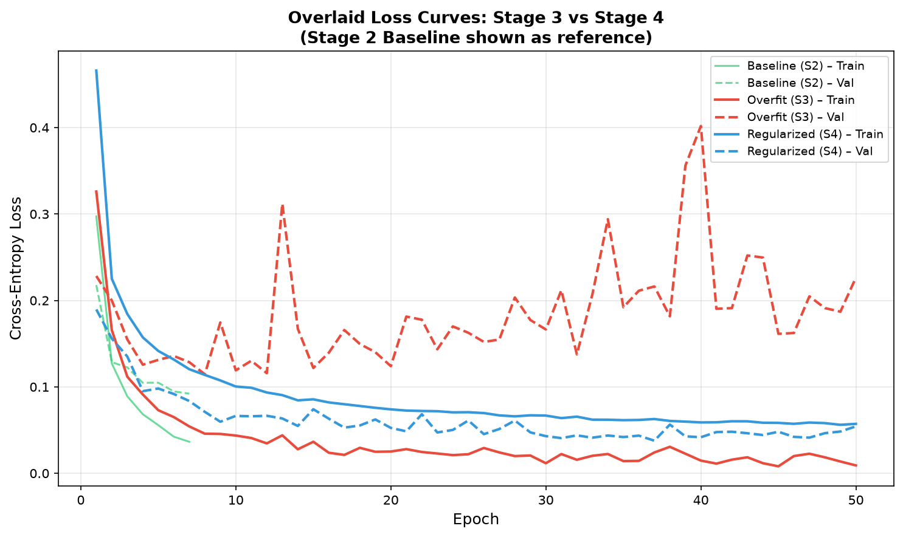
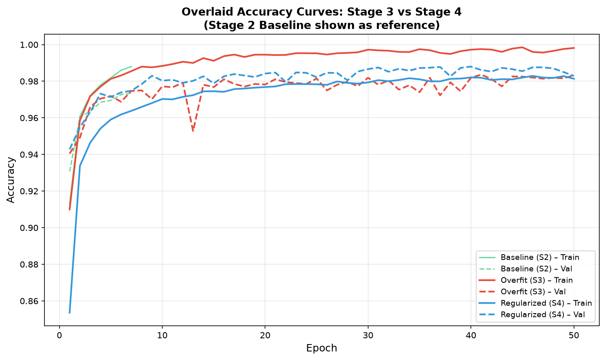

# MNIST Digit Recognition

This project trains neural networks to recognize handwritten digits from the MNIST dataset. It is written as a Jupyter notebook using PyTorch and demonstrates three important machine learning ideas:

- how a simple baseline model behaves on MNIST
- how a very large model can overfit training data
- how regularization can improve performance on unseen data

The main notebook is [`mnist_digit_recognition.ipynb`](mnist_digit_recognition.ipynb).

## Project Overview

The project uses the MNIST dataset, which contains 70,000 grayscale images of handwritten digits from 0 to 9. Each image is 28 x 28 pixels.

The notebook follows four main stages:

1. Data pipeline: load MNIST, normalize the images, and create train, validation, and test loaders.
2. Baseline model: train a smaller fully connected network to establish normal learning behavior.
3. Overfitting experiment: train a much larger fully connected network without regularization.
4. Regularized experiment: train the same large architecture again with data augmentation, lower learning rate, and weight decay.

The goal is not just to get high accuracy, but to compare a healthy baseline, an intentionally overfit model, and a regularized model that generalizes better.

## Dataset Split

| Split | Samples | Purpose |
|---|---:|---|
| Training | 50,000 | Used to update model weights |
| Validation | 10,000 | Used to monitor generalization during training |
| Test | 10,000 | Used only for final evaluation |

## Model Architectures

### BaselineNet

`BaselineNet` is the normal reference model. It is small enough to learn MNIST well without intentionally encouraging overfitting.

```text
Input image: 1 x 28 x 28
Flatten: 784 features
Linear: 784 -> 128, ReLU
Linear: 128 -> 64, ReLU
Linear: 64 -> 10
Output: logits for digits 0-9
```

Total trainable parameters: **109,386**.

### OverfitNet

`OverfitNet` is a much larger fully connected network. It is used in both the overfitting experiment and the regularized experiment.

```text
Input image: 1 x 28 x 28
Flatten: 784 features
Linear: 784 -> 2048, ReLU
Linear: 2048 -> 2048, ReLU
Linear: 2048 -> 2048, ReLU
Linear: 2048 -> 2048, ReLU
Linear: 2048 -> 1024, ReLU
Linear: 1024 -> 10
Output: logits for digits 0-9
```

Total trainable parameters: **16,305,162**.

## Results

| Metric | Stage 2: BaselineNet | Stage 3: OverfitNet | Stage 4: Regularized OverfitNet |
|---|---:|---:|---:|
| Epochs | 7 | 50 | 50 |
| Final train loss | 0.0364 | 0.0091 | 0.0572 |
| Final validation loss | 0.0921 | 0.2264 | 0.0543 |
| Final train accuracy | 98.80% | 99.82% | 98.14% |
| Final validation accuracy | 97.35% | 98.32% | 98.29% |
| Train-validation accuracy gap | 1.45 percentage points | 1.50 percentage points | -0.15 percentage points |
| Test accuracy | 97.49% | 98.19% | 98.56% |

The baseline model provides a healthy reference point. The overfit model achieves the highest training accuracy, but its validation loss rises. The regularized model gives the best held-out test accuracy, improving from **98.19%** to **98.56%**.

## Generated Outputs

The notebook generates these result images:

- [`figures/stage2.png`](figures/stage2.png): Stage 2 baseline model training and validation curves.
- [`figures/stage3.png`](figures/stage3.png): Stage 3 overfitting model training and validation curves.
- [`figures/stage4.png`](figures/stage4.png): Stage 4 regularized model training and validation curves.
- [`figures/loss_curves.png`](figures/loss_curves.png): loss comparison for the overfit and regularized models.
- [`figures/fig7_loss_comparison.png`](figures/fig7_loss_comparison.png): overlaid loss curves for baseline, overfit, and regularized models.
- [`figures/fig8_accuracy_comparison.png`](figures/fig8_accuracy_comparison.png): overlaid accuracy curves for baseline, overfit, and regularized models.
- [`figures/per_class_accuracy.png`](figures/per_class_accuracy.png): accuracy for each digit class.
- [`figures/confusion_matrix.png`](figures/confusion_matrix.png): confusion matrix for the regularized model's test predictions.

Preview:







The university report is available at [`report/MNIST_Research_Report_final.docx`](report/MNIST_Research_Report_final.docx).

## Project Structure

```text
mnstproj/
|-- .gitignore                           # Ignores local data and virtual environment files
|-- data/
|   `-- MNIST/
|       `-- raw/                         # Downloaded MNIST files
|-- figures/
|   |-- confusion_matrix.png             # Confusion matrix for test predictions
|   |-- fig7_loss_comparison.png         # Baseline vs overfit vs regularized loss curves
|   |-- fig8_accuracy_comparison.png     # Baseline vs overfit vs regularized accuracy curves
|   |-- loss_curves.png                  # Stage 3 vs Stage 4 loss curves
|   |-- per_class_accuracy.png           # Accuracy by digit class
|   |-- stage2.png                       # Stage 2 baseline chart
|   |-- stage3.png                       # Stage 3 overfitting chart
|   `-- stage4.png                       # Stage 4 regularized training chart
|-- mnist_env/                           # Local Python virtual environment
|-- report/
|   `-- MNIST_Research_Report_final.docx # University submission report
|-- mnist_digit_recognition.ipynb        # Main project notebook
|-- README.md                            # Project documentation
`-- requirements.txt                     # Python package dependencies
```

## Requirements

The project uses:

- Python 3.11
- PyTorch
- torchvision
- NumPy
- Matplotlib
- scikit-learn
- Jupyter Notebook or JupyterLab

The folder already contains a local virtual environment named `mnist_env`.
Dependencies are listed in [`requirements.txt`](requirements.txt).

## How to Run

### Option 1: Use the existing virtual environment

In PowerShell:

```powershell
.\mnist_env\Scripts\Activate.ps1
jupyter notebook mnist_digit_recognition.ipynb
```

Then run the notebook cells from top to bottom.

### Option 2: Create a fresh environment

```powershell
python -m venv mnist_env
.\mnist_env\Scripts\Activate.ps1
python -m pip install -r requirements.txt
jupyter notebook mnist_digit_recognition.ipynb
```

## Reproducibility Notes

- The notebook uses a fixed random seed.
- The train/validation split is fixed so all stages are compared fairly.
- `BaselineNet` establishes normal learning behavior with a compact network.
- `OverfitNet` is used unchanged in Stage 3 and Stage 4.
- Stage 4 changes only the training procedure, not the large model architecture.

## Key Learning Outcome

The main lesson is that high training accuracy alone does not prove that a model is best. The baseline model gives a healthy reference, the overfit model shows what happens when capacity is excessive, and the regularized model shows how data augmentation, weight decay, and a lower learning rate can improve generalization.
